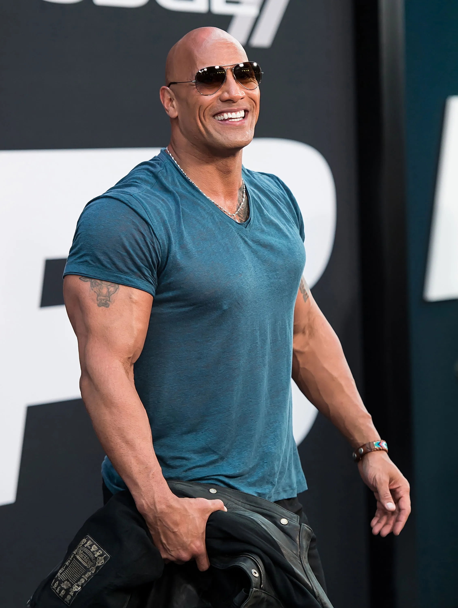
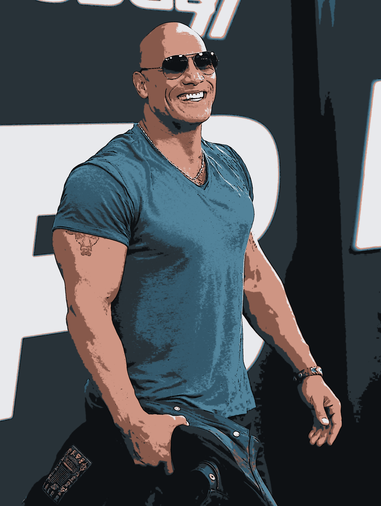

# Cartoonify Image
This project is about cartoonifying an image using machine learning. Specifically, unsupervised machine learning algorithm.
 
I used one of the popular clustering algorithm called **KMeans**. I used the algorithm for color palette control and some opencv-numpy transformation for the edge drawing. Have a look at my notebook!
 

| Original Image  | Cartoonifed Image |
| ------------- | ------------- |
|   |   |
